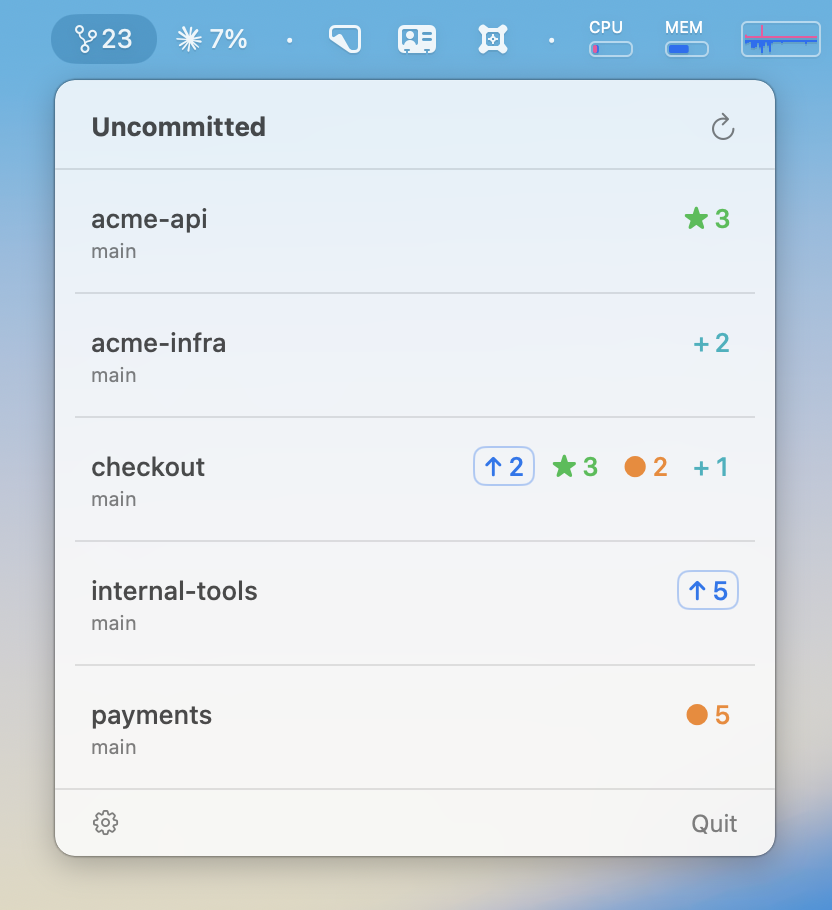
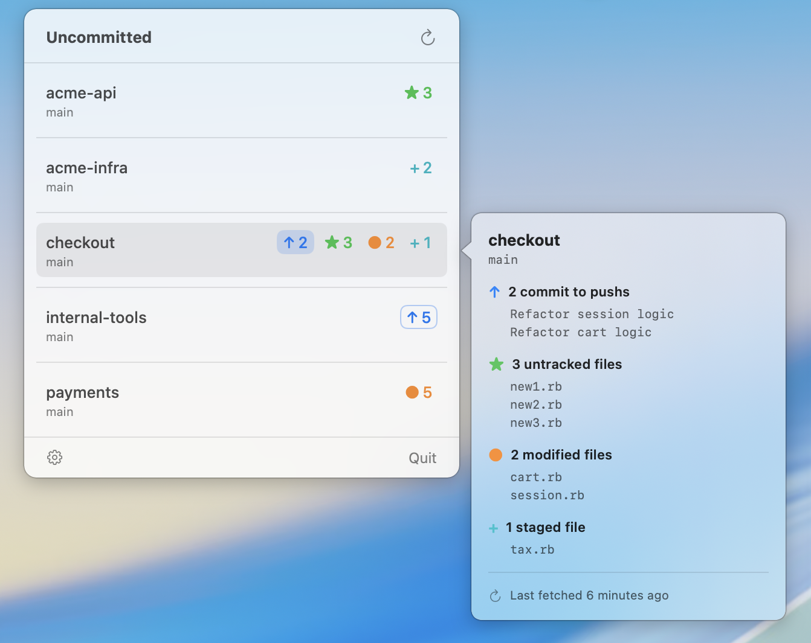
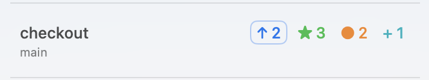
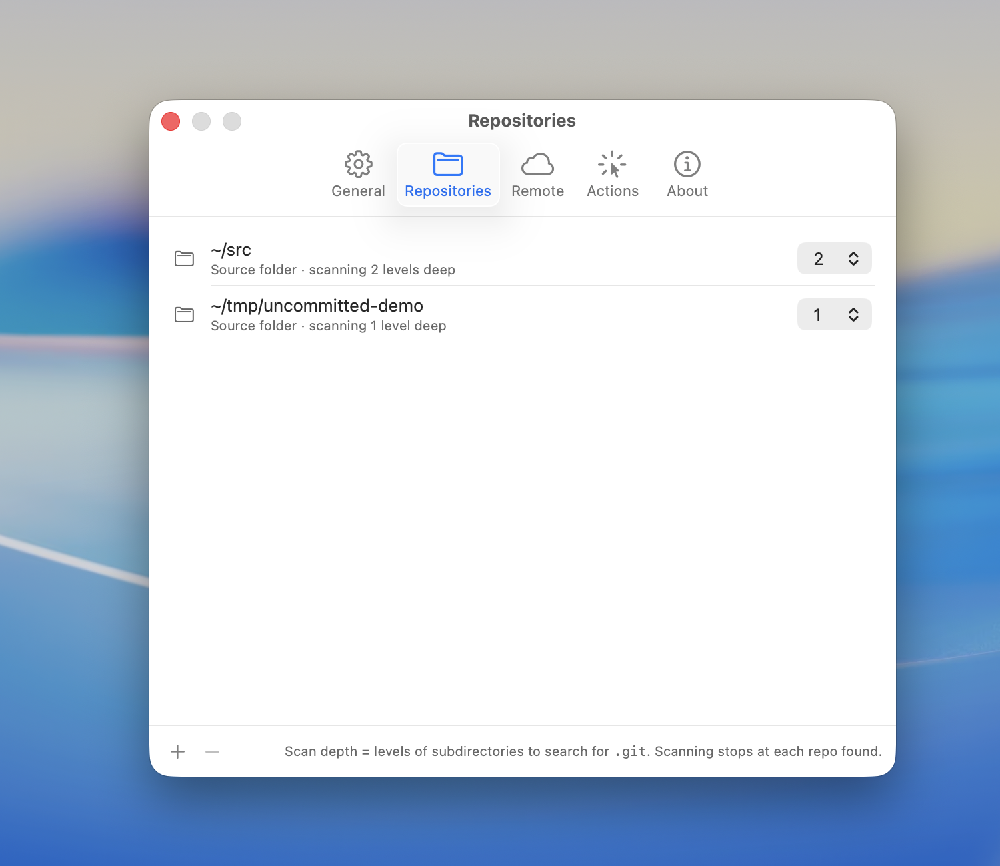
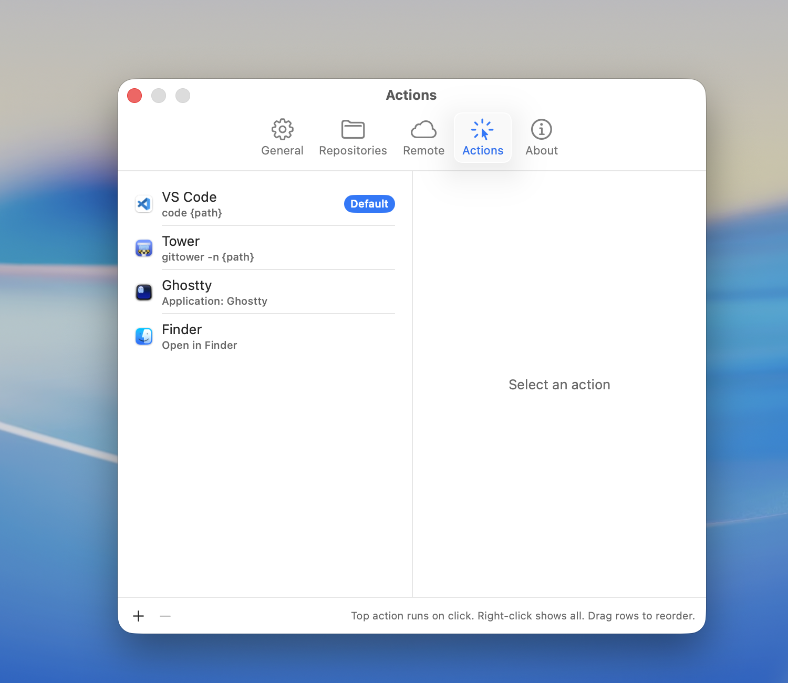
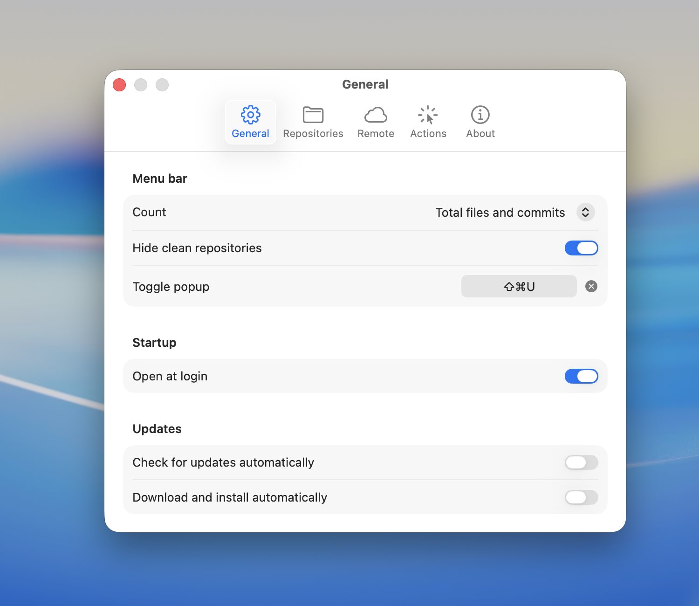

# Uncommitted

A native macOS menubar app that tracks uncommitted and unpushed changes across
your git repositories. SwiftUI + AppKit, no polling, no dependencies.


## Download

**[Latest release on GitHub →](https://github.com/thimo/uncommitted/releases/latest)**

Grab `Uncommitted-X.Y.Z.zip` from the latest release — universal binary
(`arm64` + `x86_64`, macOS 14+), signed with my Apple Developer ID and
notarized by Apple. Unzip, drag `Uncommitted.app` into `~/Applications/`
(or `/Applications/`), and launch. First run passes Gatekeeper without
prompts.

After installation the app updates itself: a built-in Sparkle 2.x updater
checks for new releases on launch and once a day, and prompts when one is
available. No manual download needed for subsequent versions.

Prefer to build from source? See [Building from source](#building-from-source)
below.

## What it does

At-a-glance status for every repo you care about:

- Live file-system watcher (FSEvents) — no polling, no refresh button needed
- Uncommitted file counts broken down by category (untracked / modified / staged)
- Unpushed and unpulled commit counts per repo
- Click a row to open in your preferred app (VS Code, Tower, Terminal, Finder,
  or any custom shell command)
- Right-click a row for the full action list
- "Hide repositories with no changes" toggle so you only see what needs attention



Hover any row for a detail panel with the recent commits behind that
repo's counts:



## Menu bar label

A git-branch icon followed by a single at-a-glance number: **how many
repositories need your attention**. Click for the full breakdown.

| State | Label |
|---|---|
| All repositories clean | branch icon only |
| Three repositories have uncommitted or unpushed work | branch icon + `3` |

The per-file counts (`↑7`, `★2`, `●10`, `+1`) live inside the popover, one
row per repo — not in the menu bar. Menu bars are for "do I need to care?"
signals, not data.

## Status badges

Each repo row carries compact badges for everything that needs attention:

| Badge | Meaning | Color |
|---|---|---|
| `↑ N` | N commits ahead of upstream (click to push) | blue |
| `↓ N` | N commits behind upstream (click to pull) | purple |
| `★ N` | N untracked (new) files | green |
| `● N` | N modified files (macOS's "unsaved" glyph) | orange |
| `+ N` | N staged files | teal |
| `✓` | clean | green |

The `↑` and `↓` badges are pill-shaped and interactive — click the `↑`
to run `git push`, click the `↓` to run `git pull`. The rest are
read-only indicators.



## Push and pull

Clicking the `↑` pill runs **`git push`** with whatever upstream the
branch tracks. If the push is rejected, an alert surfaces git's actual
error text and nothing changes locally.

Clicking the `↓` pill runs **`git pull --ff-only`**, deliberately —
plain `git pull` either creates a merge commit or rewrites local
history depending on config, neither of which should happen from a
one-click button. With `--ff-only`, a diverged branch aborts with an
error and you resolve it manually.

A spinner replaces the badge count while either action runs; the badge
updates within a second of completion via the FSEvents watcher.

## GitHub status

Per-repo PR and CI signals next to the local-state pills. Answers
"is what I just pushed green?" and "is there anything queued that needs
cleanup?" without leaving the menu bar.

| Badge | Meaning |
|---|---|
| ⚠️ | CI failed on the latest push to your current branch |
| 🕐 | CI is running on the latest push |
| `⤴ 4 / 2` | 4 human-authored open PRs · 2 by bots (the bot tail is muted) |

Green CI is invisible by design — the menu bar is for things that need
attention, not confirmation. The branch icon in the menu bar itself
turns **red** whenever any tracked repo has failing CI, so a single
glance tells you "is anything broken?" without opening the popover.

Click the PR pill to open the GitHub PR list; click the red/yellow CI
badge to open the Actions page filtered to that branch.

GitHub access uses the [`gh` CLI][gh] — install with `brew install gh`,
then run `gh auth login`. The scheduler refreshes active repos every 15
minutes, idle repos once a day, and eagerly on every popover open.
Multi-clone repos share API calls automatically.

Toggle the feature in Settings → General → GitHub. Full details:
[docs/github-integration.md](docs/github-integration.md).

[gh]: https://cli.github.com

## Auto-fetch from remotes

By default Uncommitted only reads what's already on disk — the unpulled
count reflects whatever was last fetched manually. Turn on **Auto-fetch
from remotes** in Settings → General to have Uncommitted run `git fetch`
in the background on a tiered cadence:

- Repos with activity in the last week: every **24 hours**
- Older repos: every **7 days**

Fetches run silently in the background. Repos that fail to fetch back
off exponentially up to 30 days, then go dormant; a small warning glyph
next to the repo name surfaces problems before they get there. Repos
without a remote are skipped entirely.

To fetch on demand, **Option-click** the refresh button in the popover
header (the icon swaps to indicate the alternate action), or use the
"Fetch from remote" item on a repo row's right-click menu. A manual
fetch always runs, even on dormant repos.

Full details: [docs/auto-fetch.md](docs/auto-fetch.md).

## Requirements

- macOS 14 (Sonoma) or later
- `git` in `/usr/bin/git` (Apple's `/usr/bin/git` shim, or Xcode Command Line
  Tools)

## Building from source

No Xcode project — just SwiftPM and a shell script.

```bash
git clone https://github.com/thimo/uncommitted.git
cd uncommitted
./build.sh
open ~/Applications/Uncommitted.app
```

`build.sh` does the whole bundle: `swift build -c release`, renders the app
icon programmatically via `Resources/make-icon.swift`, wraps the binary in a
proper `.app` with `Info.plist`, ad-hoc codesigns, quits any running instance,
and installs to `~/Applications/Uncommitted.app`.

The app is `LSUIElement`, so there's no Dock icon — look for it in the menu
bar.

## Usage

### Repositories (Cmd+, → Repositories)

Add *source folders* with the **+** button. A source folder is any directory:

- If it contains a `.git`, it's treated as a single repository
- Otherwise, it's scanned N levels deep for child `.git` directories

Depth is configurable per source (0–5). Scanning stops at each repo found, so
submodules and nested checkouts aren't treated as separate repos.



### Actions (Cmd+, → Actions)

Configure what happens when you click a repo row in the popover. Default list
is Finder + VS Code + Terminal; add more with the **+** menu:

- **Add Application…** — native file picker filtered to `.app` bundles; icon
  pulled from the bundle (also works for Setapp-installed apps)
- **Add Custom Command…** — zsh command template, use `{path}` as the repo
  path placeholder (e.g. `open -a Ghostty {path}`)

The **top** action runs on left-click. Right-click the repo row in the menu
bar popover to pick any of the others. Drag to reorder.

**Tip:** Some apps work better as custom commands than as application actions.
For example, `gittower -n {path}` opens Tower in a new tab (or focuses the
repo if already open), while the application action replaces the current tab.
Similarly, `code {path}` uses VS Code's IPC to reuse the existing window
across desktops. Set the **Icon** field to the app name (e.g. "Tower") to
keep the app icon in the action list.



### General (Cmd+, → General)

- **Hide repositories with no changes** — only show repos that need attention
- **Launch Uncommitted at login** — via `SMAppService`
- **Auto-fetch from remotes** — periodic background `git fetch` so the
  unpulled count stays current without manual intervention. See [Auto-fetch
  from remotes](#auto-fetch-from-remotes).



### Config file

Settings persist to `~/Library/Application Support/Uncommitted/config.json`
with atomic writes, debounced 300ms. Safe to edit by hand if you really want
to.

## Architecture

- Swift Package, single executable target, no Xcode project required
- SwiftUI views throughout: popover content, Settings scene, all tabs
- AppKit `NSStatusItem` + `NSMenu` with a single custom-view item hosting
  an `NSHostingView` of the SwiftUI content — earlier iterations used
  `MenuBarExtra` (no programmatic dismiss) and `NSPopover` (visible arrow
  on macOS 15 with no API to hide it); `NSMenu` gives us the system
  button highlight, cross-menu dismissal, and correct positioning for free
- `FSEvents` watcher per resolved repo with configurable scan depth — no
  polling; the only background work is `git status --porcelain=v2 --branch`
  triggered by file changes, run on a serial utility queue so nothing blocks
  the main thread
- A failed or suspect `git status` parse never clobbers a known-good status,
  which keeps the UI stable when git is mid-operation (fetch, push, etc.)

## Why not SwiftBar / Barmaid / AnyBar?

Those are all great tools, but I wanted:

- A real native Settings window with proper preferences, not a JSON file
- Live updates via FSEvents instead of a 5-minute polling interval
- Custom per-repo actions with icons pulled from the actual apps
- A genuinely beautiful Mac app that keeps an eye on my repos all day

First "beautiful Mac app" project for me.

## License

MIT — see [LICENSE](./LICENSE).
